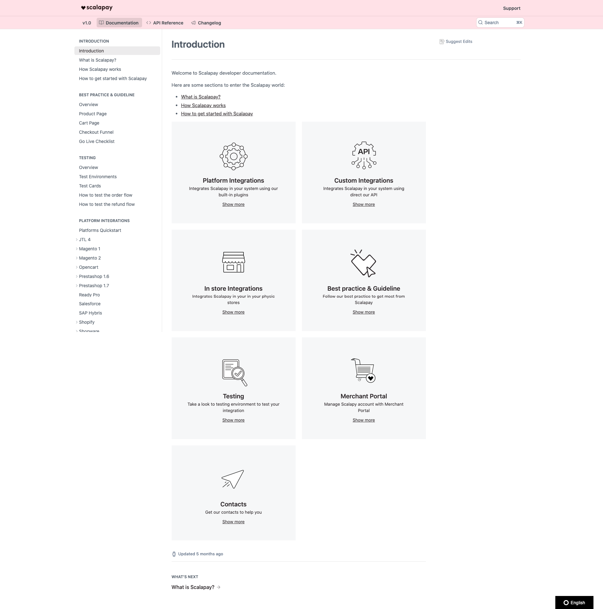

# Case study for Lead Software Engineer - discovery team

## Task

Please write a static website that mimic the below image using

- HTML 
- CSS 
- JS
Of course this is only a blue-print, feel free to beautify it

## STATIC PAGE URL: 
home.html

## Task
Implement a really basic search engine by invoking algolia API (see below link)

## Algolia documentation:

- https://www.algolia.com/doc/

## SEARCH PAGE URL: 
search.html (you can use sidebar link in home.html)

## Additional:
- We are looking for a cross functional team leader: think outside of the box
- Use lorem ipsum for the content
- Please include in the README.md file instructions on how to run the website on our machines.
- In addition to the above, please write a recommendation on how we can use the above tests across our Development, Staging and Production environments.

## HOW TO RUN: 
Please download and install in a nodejs environment
